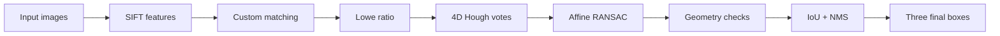
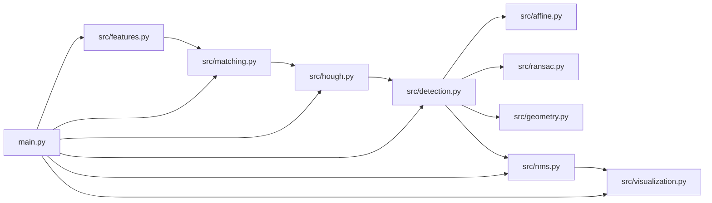
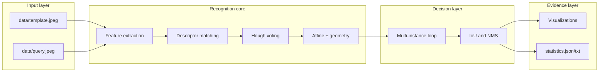
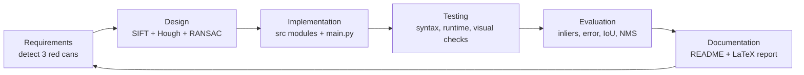

# Multi-Instance Coca-Cola Can Recognition

> A from-scratch computer-vision pipeline for finding multiple template objects in a cluttered scene.

This project detects and localizes three red Coca-Cola cans despite scale changes, partial cropping, repeated artwork, background clutter, and distractor objects. It combines SIFT features with custom descriptor matching, generalized Hough voting, affine RANSAC, geometric verification, and IoU-based non-maximum suppression.

## At A Glance

| Property | Implementation |
| --- | --- |
| Input | `data/template.jpeg` and `data/query.jpeg` |
| Feature detector | OpenCV SIFT |
| Descriptor matching | Manual Euclidean distance |
| Ambiguity filtering | Lowe ratio test, default `0.85` |
| Geometric voting | Custom 4D Hough space: center, scale, rotation |
| Transformation model | Affine least squares |
| Robust estimation | Custom three-point RANSAC |
| Duplicate suppression | Manual IoU and NMS |
| Main output | `outputs/18_final_detection.jpg` |

## Quick Start

From the project root:

```bash
python3 -m venv .venv
source .venv/bin/activate
python -m pip install -r requirements.txt
python main.py
```

The program prints detection statistics and writes visualizations to `outputs/`. To compile the research-style report:

```bash
pdflatex report.tex
pdflatex report.tex
```

The report source is [report.tex](report.tex), and the compiled document is [report.pdf](report.pdf).

## Interactive Architecture

Mermaid diagrams are provided as compact documentation views. Use a Mermaid-enabled Markdown preview or the Mermaid Live Editor to render them.

### Compact Pipeline Overview



### Software Components



### Component Responsibilities



### SDLC Lifecycle



The lifecycle is iterative: visual failures feed back into configuration and geometry checks, while quantitative statistics guide threshold changes.

## Project Structure

```text
assignment/
├── data/
│   ├── template.jpeg              # Clean template object
│   └── query.jpeg                 # Cluttered scene
├── src/
│   ├── config.py                  # Thresholds and runtime configuration
│   ├── features.py                # Image loading and SIFT extraction
│   ├── matching.py                # Euclidean matching and Lowe ratio test
│   ├── hough.py                   # 4D hypothesis generation and voting
│   ├── affine.py                  # Least-squares affine fitting
│   ├── ransac.py                  # Robust affine model estimation
│   ├── geometry.py                # Projection and sanity checks
│   ├── detection.py               # Greedy multi-instance detection loop
│   ├── nms.py                     # Manual IoU and NMS
│   └── visualization.py           # Diagnostic and report figures
├── outputs/                       # Generated figures and statistics
├── main.py                        # Pipeline entry point
├── report.tex                     # LaTeX research report
├── requirements.txt               # Python dependencies
└── README.md
```

## Detection Pipeline

1. **SIFT extraction**: find scale- and orientation-aware keypoints in the template and scene.
2. **Custom matching**: compute Euclidean distances from every scene descriptor to template descriptors.
3. **Lowe filtering**: retain a match only when its nearest descriptor is more distinctive than its second-nearest descriptor.
4. **Hough voting**: convert each accepted match into a predicted object center, scale, and rotation.
5. **Cluster selection**: group compatible 4D votes using custom binning.
6. **Affine RANSAC**: estimate a model from three non-collinear matches and count reprojection-error inliers.
7. **Geometric verification**: reject invalid determinant, scale, error, polygon, and bounding-box configurations.
8. **Multi-instance extraction**: remove accepted inliers and repeat the search for another object.
9. **NMS**: suppress overlapping duplicate boxes using manually computed IoU.
10. **Reporting**: save visual diagnostics, final detections, and statistics.

## Mathematical Core

### Descriptor distance

For scene descriptor $s_i$ and template descriptor $t_j$:

$$
d(s_i,t_j)=\sqrt{\sum_q(s_{iq}-t_{jq})^2}.
$$

### Lowe ratio test

With nearest and second-nearest distances $d_1$ and $d_2$:

$$
r=\frac{d_1}{d_2}, \qquad r < \tau.
$$

The default threshold is $\tau=0.85$.

### Generalized Hough hypothesis

For a template center-to-keypoint vector $v$, scale $s$, and rotation $\theta$:

$$
v'=sR(\theta)v, \qquad c_{scene}=p_{scene}-v'.
$$

Each correspondence votes in $(c_x,c_y,s,\theta)$ space.

### Affine model and reprojection error

$$
x_s=ax_t+by_t+c, \qquad y_s=dx_t+ey_t+f.
$$

The parameters are estimated with least squares. For a transformed template point $\hat{p}_s$ and observed scene point $p_s$:

$$
e=\|\hat{p}_s-p_s\|_2.
$$

### Intersection over union

$$
\operatorname{IoU}(A,B)=\frac{|A\cap B|}{|A\cup B|}.
$$

## Assignment Compliance

Implemented explicitly:

- Euclidean descriptor distance
- Lowe ratio test
- Four-dimensional generalized Hough voting
- Custom vote binning and clustering
- Affine least-squares solving with `np.linalg.lstsq`
- Three-point affine RANSAC
- Reprojection-error verification
- Polygon and bounding-box sanity checks
- Manual IoU and non-maximum suppression
- Greedy inlier subtraction for multiple instances

Intentionally not used:

- `cv2.BFMatcher`
- `cv2.FlannBasedMatcher`
- `cv2.estimateAffine2D`
- `cv2.findHomography`
- `sklearn.cluster`

OpenCV is used only for permitted image I/O, SIFT extraction, image processing helpers, drawing, and visualization.

## Configuration

Adjust thresholds in [src/config.py](src/config.py):

| Parameter group | Examples | Purpose |
| --- | --- | --- |
| Matching | `ratio_threshold` | Controls descriptor ambiguity filtering |
| Hough space | `hough_x_bin_size`, `hough_scale_bin_size` | Controls vote quantization |
| Hough support | `min_hough_votes` | Minimum cluster support |
| RANSAC | `ransac_iterations`, `ransac_error_threshold`, `min_inliers` | Controls robust model fitting |
| Geometry | `min_affine_scale`, `max_affine_scale`, `max_mean_reprojection_error` | Rejects implausible transforms |
| Suppression | `nms_iou_threshold` | Removes duplicate boxes |
| Debugging | `verbose`, `visualization_enabled` | Controls logs and generated figures |

## Generated Outputs

Running `python main.py` creates report-ready figures in `outputs/`:

| Files | Purpose |
| --- | --- |
| `01`-`05` | Inputs, keypoints, scale, and orientation diagnostics |
| `06`-`09` | Naive matches, descriptor distances, Lowe ratios, and filtered matches |
| `10`-`13` | Hough center, scale, rotation, and vote visualizations |
| `14`-`15` | RANSAC inlier/outlier and affine projection diagrams |
| `16`-`17` | Pre-NMS candidates and IoU matrix |
| `18_final_detection.jpg` | Final NMS-filtered detections |
| `19_pipeline_summary.jpg` | Compact end-to-end visual summary |
| `statistics.json` | Machine-readable counts and per-detection metrics |
| `statistics.txt` | Human-readable run summary |

For the most important comparison, open:

1. `outputs/06_naive_matches.jpg` for the chaotic appearance-only overlay.
2. `outputs/09_matches_after_ratio_test.jpg` for filtered correspondences.
3. `outputs/18_final_detection.jpg` for the three final object boxes.

## Troubleshooting

**Input image error**

Confirm that both files exist with the exact names:

```text
data/template.jpeg
data/query.jpeg
```

**Missing `cv2` or `numpy`**

Activate the virtual environment and install dependencies again:

```bash
source .venv/bin/activate
python -m pip install -r requirements.txt
```

**Figures are stale**

Run `python main.py` again before compiling `report.tex`.

**Mermaid diagrams show as plain text**

Use a Mermaid-enabled Markdown preview or paste the diagram into the Mermaid Live Editor.
